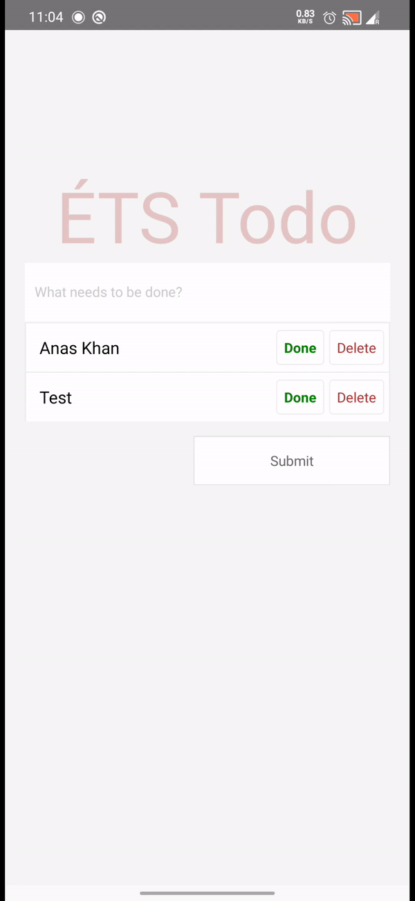

# ETS-TODO-ReactNative

### Demo

<p align="center">
  
</p>

### About the application

- The ETS Todo App was designed using Figma
- Input Text Field to write the task
- Tapping the submit button accepts the task.
- Each task has two option either to delete or mark it as done.
- Delete would remove the task from the screen.

### Installation

```shell
git clone git@github.com:srdjanprpa/FormulaOne.git
cd ETSTodoApp
npm install
```

### Run APP
**For iOS:**   
`react-native run-ios` or `npm run ios`

**For Android:**   
`react-native run-android` or `npm run android`

### Requirements

- [Node](https://nodejs.org) `4.x` or newer
- [React Native](http://facebook.github.io/react-native/docs/getting-started.html) for development
- [Android Studio](https://developer.android.com/studio/index.html) for Android development
- [Xcode](https://developer.apple.com/xcode/) for iOS development
- [Android SDK](https://developer.android.com/sdk/) `23.0.1` or newer for Android development
